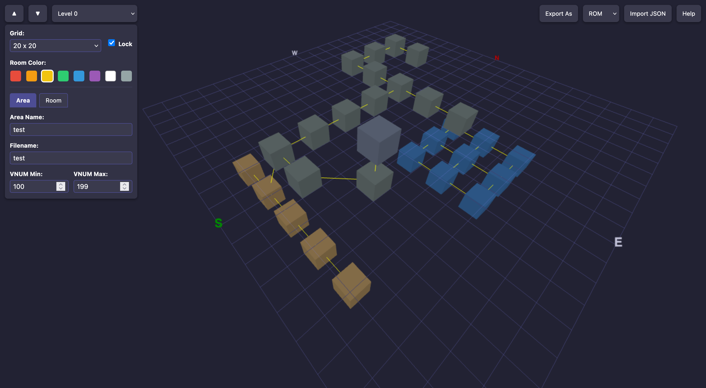

# MUD Area Editor

Dive into classic MUD world building with a "modern" twist! This browser based area editor lets you visually create, edit, and manage rooms, exits, and areas for your favorite MUD codebases including ROM and JSON format for backup. Instantly shape your dungeon’s map, fine tune layouts, and export with ease all from the comfort of your web browser.

## Demo

[ Main ] Behold, brave dungeon architect! Venture forth to a tested, dragon-approved realm:
[https://elanoran.github.io/mud_area_editor/](https://elanoran.github.io/mud_area_editor/)

[ Dev ] Enter at your own risk! This is the half-baked workshop of a wizard still learning fireball control.
[https://mud-area-editor.pages.dev/](https://mud-area-editor.pages.dev/)



## Supported Features

- Grid-based room layout per level
- Room VNUM, name, description editing
- Support for multiple export formats:
  - **ROM**
  - **AW**
- JSON import/export for sharing and backups
- Live room linking and directional exits
- Area-level metadata: filename, VNUM ranges, etc.

## Format Template Support

All supported formats use templates stored in `formats.json`:

```json
{
  "formats": {
    "ROM": {
      "fileExtension": "are",
      "area": "#AREA\n%FILENAME%~\n%AREA_NAME%~\n{ NONE} Elan     AreaEditor~\n%VNUM_MIN% %VNUM_MAX%\n\n#MOBILES\n#0\n\n#OBJECTS\n#0\n\n#ROOMS\n%ROOMS%#0\n\n#RESETS\nS\n\n#SHOPS\n0\n\n#SPECIALS\nS\n\n#$\n",
      "room": "#%ROOM_VNUM%\n%ROOM_NAME%~\n%ROOM_DESC%\n~\n%FLAGS% %SECTOR% %UNKNOWN%\n%EXITS%%EXTRAS%S\n",
      "exit": "D%DIRECTION%\n%DOOR_DESC%~\n%KEYWORDS%~\n%FLAGS% %KEY% %TO_VNUM%\n",
      "extra": "E\n%KEYWORDS%~\n%EXTRA_DESC%~\n",
      "dirLabels": [
        "North",
        "East",
        "South",
        "West",
        "Up",
        "Down",
        "Northeast",
        "Northwest",
        "Southeast",
        "Southwest"
      ]
    },
    "AW": {
      "fileExtension": "are",
      "area": "#AREADATA\nName %AREA_NAME%~\nBuilders none~\nVNUMs %VNUM_MIN% %VNUM_MAX%\nCredits { NONE} Elan     AreaEditor~\nSecurity 9\nFlags 0\nEnd\n\n#MOBDATA\n#0\n\n#OBJDATA\n#0\n\n#ROOMDATA\n%ROOMS%#0\n\n#RESETS\nS\n\n#MOBPROGS\n#0\n\n#OBJPROGS\n#0\n\n#ROOMPROGS\n#0\n\n#$\n",
      "room": "#%ROOM_VNUM%\nName   %ROOM_NAME%~\nDescr\n%ROOM_DESC%\n~\nFlags  %FLAGS% %EXTRA_FLAGS%\nSect   %SECTOR%\n%EXITS%End\n",
      "exit": "Door %DIRECTION% %FLAGS% %KEY% %TO_VNUM%\n~\n~\n",
      "dirLabels": ["North", "East", "South", "West", "Up", "Down"]
    },
    "JSON": {
      "fileExtension": "json",
      "area": "",
      "room": "",
      "exit": "",
      "dirLabels": []
    }
  }
}
```

You can add new formats to `formats.json` without modifying the core code, making this editor easily extendable.

## Usage

1. Launch `index.html` in a browser.
2. Use the sidebar to input room data.
3. Click to place and link rooms.
4. Use export/import buttons to work with file formats or JSON.
5. This editor loads resources via JavaScript, so a web server is required to avoid CORS or file access issues. You can use Python’s built-in server for quick testing:

   For Python 3:
   ```bash
   python3 -m http.server
   ```

   Then open your browser to `http://localhost:8000`.

   For Python 2:
   ```bash
   python -m SimpleHTTPServer
   ```

   Or use any other static web server (e.g., http-server from npm, nginx, etc).

## Notes

- Default export uses the currently selected format in the dropdown.
- Rooms without names or descriptions will use the VNUM as fallback.
- AW and ROM formats currently have the best support.

---

## Disclaimer

This project is a **work in progress**. No extensive testing has been done. Use at your own risk and always keep backups.
