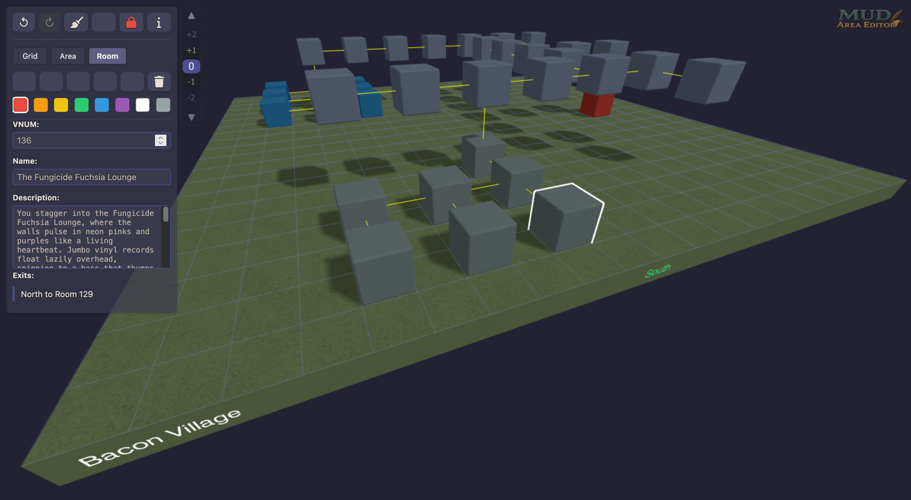

# MUD Area Editor

[](https://github.com/Elanoran/mud_area_editor/blob/main/LICENSE)&nbsp;&nbsp;&nbsp;[](https://github.com/Elanoran/mud_area_editor/stargazers)&nbsp;&nbsp;&nbsp;[](https://github.com/Elanoran/mud_area_editor/releases)&nbsp;&nbsp;&nbsp;[](https://paypal.me/Elanoran?country.x=DK&locale.x=da_DK)

Welcome, intrepid MUD [m(ulti-)u(ser) d(ungeon), m(ulti-)u(ser) d(imension) and m(ulti-)u(ser) d(omain).] world mapshaper, to the Most Convenient Area Editor in the Multiverse (or at least the Internet). Whether you’re crafting a dank oubliette beneath a questionable tavern or a sunlit glade frequented by musical pixies with identity crises, this tool spares you the torment of scribbling ASCII diagrams on tavern napkins. Instead, you point'n click, drag'n drop, and generally conduct your dungeon-building with all the ease of rearranging rooms in the Shades (but with significantly fewer pickpockets).

## Table of Contents

- [Demo](#demo)
- [Supported Features](#supported-features)
- [Format Template Support](#format-template-support)
- [Usage](#usage)
- [Branch Model](#branch-model)
- [Notes](#notes)
- [Disclaimer](#disclaimer)

## Demo

[ Main ] Behold, brave dungeon architect! Venture forth to a tested, dragon-approved realm:  

[https://elanoran.github.io/mud_area_editor/](https://elanoran.github.io/mud_area_editor/)

[ Dev ] Enter at your own risk! This is the half-baked workshop of a wizard still learning fireball control:  

[https://mud-area-editor.pages.dev/](https://mud-area-editor.pages.dev/)



## Supported Features

Imagine a pantheon of features so robust even the Gods of Chaos would nod in approval:

- **Grid-based Room Layout**: Like plotting a map of Olympus’s back alleys, but without the risk of being pickpocketed. Arrange rooms on a grid and watch your labyrinth take shape.
- **Room Editing**: Grant each room its identity, be it “The Gloomy Cellar of Questionable Smells” or “Elan’s Suspect Library Annex.” VNUMs keep the bureaucrats happy; descriptions keep adventurers from complaining.
- **Support for Multiple Export Formats**:
- **ROM**: For the traditionalist who believes in sacred scrolls (file format scrolls, that is).
- **AW**: For those who enjoy a different incantation when summoning their area files.
- **JSON Import/Export**: Because nothing says “I trust my code” like backing it up to a format readable by goats (or other JSON parsers).
- **Live Room Linking**: Exits appear faster than a wizard’s teleportation spell. Link rooms north, south, or “through that door that really shouldn’t exist but somehow does.”
- **Area-level Metadata**: Keep your metadata tidier than a dwarf’s beard on market day. Define ranges so your rooms don’t wander off into someone else’s dungeon.

## Format Template Support

Deep within `formats.json` lie the templates. Tinker to your heart’s content:

```json
{
  "formats": {
    "ROM": {
      "fileExtension": "are",
      "area": "#AREA\n%FILENAME%~\n%AREA_NAME%~\n{ NONE} Elan     AreaEditor~\n%VNUM_MIN% %VNUM_MAX%\n\n#MOBILES\n#0\n\n#OBJECTS\n#0\n\n#ROOMS\n%ROOMS%#0\n\n#RESETS\nS\n\n#SHOPS\n0\n\n#SPECIALS\nS\n\n#$\n",
      "room": "#%ROOM_VNUM%\n%ROOM_NAME%~\n%ROOM_DESC%\n~\n%FLAGS% %SECTOR% %UNKNOWN%\n%EXITS%%EXTRAS%S\n",
      "exit": "D%DIRECTION%\n%DOOR_DESC%~\n%KEYWORDS%~\n%FLAGS% %KEY% %TO_VNUM%\n",
      "extra": "E\n%KEYWORDS%~\n%EXTRA_DESC%~\n",
      "dirLabels": [
        "North", "East", "South", "West", "Up", "Down", "Northeast", "Northwest", "Southeast", "Southwest"
      ]
    },
    "AW": {
      "fileExtension": "are",
      "area": "#AREADATA\nName %AREA_NAME%~\nBuilders none~\nVNUMs %VNUM_MIN% %VNUM_MAX%\nCredits { NONE} Elan     AreaEditor~\nSecurity 9\nFlags 0\nEnd\n\n#MOBDATA\n#0\n\n#OBJDATA\n#0\n\n#ROOMDATA\n%ROOMS%#0\n\n#RESETS\nS\n\n#MOBPROGS\n#0\n\n#OBJPROGS\n#0\n\n#ROOMPROGS\n#0\n\n#$\n",
      "room": "#%ROOM_VNUM%\nName   %ROOM_NAME%~\nDescr\n%ROOM_DESC%\n~\nFlags  %FLAGS% %EXTRA_FLAGS%\nSect   %SECTOR%\n%EXITS%End\n",
      "exit": "Door %DIRECTION% %FLAGS% %KEY% %TO_VNUM%\n~\n~\n",
      "dirLabels": ["North", "East", "South", "West", "Up", "Down"]
    },
    "JSON": {
      "fileExtension": "json",
      "area": "",
      "room": "",
      "exit": "",
      "dirLabels": []
    }
  }
}
```

Tweak `formats.json` as you like; our code politely accommodates new rites without complaint.

## Usage

1. **Launch `index.html` in a Browser**  
   Like opening an ancient tome, but without the smell of mildew (though a hint of adventure lingers).
2. **Use the Sidebar to Input Room Data**  
   Name rooms, pen their descriptions, just don’t write anything that might summon eldritch horrors (unless intended).
3. **Shift Click to Place and Link Rooms**  
   Place rooms on the map canvas; connect exits faster than you can say “nearly forgot to add that trapdoor.”
4. **Export/Import Buttons**  
   Export when you wish to share with fellow conspirators; import when you recover from an accidental planar shift.
5. **Serve Over a Web Server to Avoid CORS Issues**  
   This editor loads resources via JavaScript, so summon a simple server:
   - For Python 3:  
     ```bash
     python3 -m http.server
     ```
     Then visit `http://localhost:8000`.
   - For Python 2:  
     ```bash
     python -m SimpleHTTPServer
     ```
   Or any other static web server, just don’t use carrier pigeons for file delivery, unless you enjoy delays.

## Branch Model

- **`main`**  
  The sacred branch, as stable as a wizard’s pension (i.e., rarely changes, but reliable as a chicken in labor).
- **`dev`**  
  The workshop of chaos: where ideas ferment, tests break things, and occasional genius emerges.

## Notes

> [!NOTE]
> Default export uses the currently selected format in the dropdown; treat it like choosing between tea or something stronger.
> Rooms without names or descriptions will default to VNUM; like an unnamed alleyway, it still leads somewhere.
> AW and ROM formats currently strut their stuff best; others may require spells of adjustment.

---

## Disclaimer

> [!CAUTION]
> This project is a work in progress, much like a novice wizard’s apprenticeship.
> No extensive testing has been done.
> Use at your own risk, and always keep backups, lest your dungeon vanish into the Void (and take your sanity with it).
