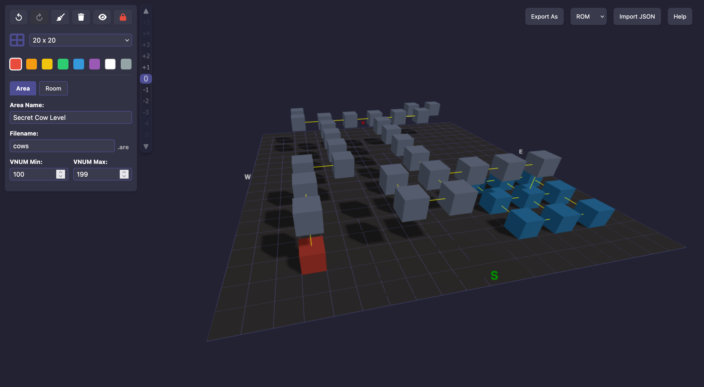

# MUD Area Editor

This is a browser-based MUD (Multi-User Dungeon) area editor for managing rooms, exits, areas, and formats such as ROM and AW.

## Screenshot



## Supported Features

- Grid-based room layout per level
- Room VNUM, name, description editing
- Support for multiple export formats:
  - **ROM**
  - **AW**
- JSON import/export for sharing and backups
- Live room linking and directional exits
- Area-level metadata: filename, VNUM ranges, etc.

## Format Template Support

All supported formats use templates stored in `formats.json`:

```json
{
  "formats": {
    "ROM": {
      "area": "...",
      "room": "...",
      "exit": "...",
      "extra": "...",
      "dirLabels": [...]
    },
    "AW": {
      "area": "...",
      "room": "...",
      "exit": "...",
      "dirLabels": [...]
    }
  }
}
```

You can add new formats to `formats.json` without modifying the core code, making this editor easily extendable.

## Usage

1. Launch `index.html` in a browser.
2. Use the sidebar to input room data.
3. Click to place and link rooms.
4. Use export/import buttons to work with file formats or JSON.
5. This editor loads resources via JavaScript, so a web server is required to avoid CORS or file access issues. You can use Python’s built-in server for quick testing:

   For Python 3:
   ```bash
   python3 -m http.server
   ```

   Then open your browser to `http://localhost:8000`.

   For Python 2:
   ```bash
   python -m SimpleHTTPServer
   ```

   Or use any other static web server (e.g., http-server from npm, nginx, etc).

## Notes

- Default export uses the currently selected format in the dropdown.
- Rooms without names or descriptions will use the VNUM as fallback.
- AW and ROM formats currently have the best support.

---

## Disclaimer

This project is a **work in progress**. No extensive testing has been done. Use at your own risk and always keep backups.